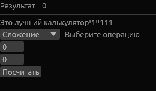

<div align="center">


</div>

# ЛУЧШИЙ КАЛЬКУЛЯТОР(относительно каменного века)
Это __BLAZING fast__(не уверен насколько) GUI-калькулятор на лучшем языке человечества.

Он умеет(в рамках типочка f64):
- Складывать(Что?!)
- Вычитать(Как?!)
- Складывать, но чуть сложнее (Это легально? В нормальных кругах это умножение)
- И даже делить!
- Удивительно, но ещё есть возможность брать корни(С учётом мнимой единицы)

Пример:



## Как запустить?
- Для супер крутых есть релиз
    - Но там нет бинарника для ОС по типу винды и прочих маков. На CachyOs у меня точно работает. Сгорит комп - не мои проблемы, сорри
- Для умных — могут сами скомпилировать, не зря же образование получали.
- Для тех, кому лень: вот спецшаги, будет их 3. Выполни все и себе помоги. К заданиям ты никогда не готов из трёх замечательных спецшагов:
Шаг первый: скопируй репозиторий(У тебя должен быть [Git](https://git-scm.com/) скачан)
```bash
git clone https://github.com/LygusCave/SuperPuperCalculator.git
```
Второй: войди в созданную папку
```bash
cd SuperPuperCalculator
```
Третий: Запусти сей шедевр(не забудь скачать [Rust](https://rustup.rs/), это важно. Если не знаешь что это спроси ИИ)
```bash
cargo run --release
```
## Лицензия
MIT, подробнее [LICENSE](LICENSE).

<sub>~~Но меня в MIT никогда не возьмут(~~</sub>

